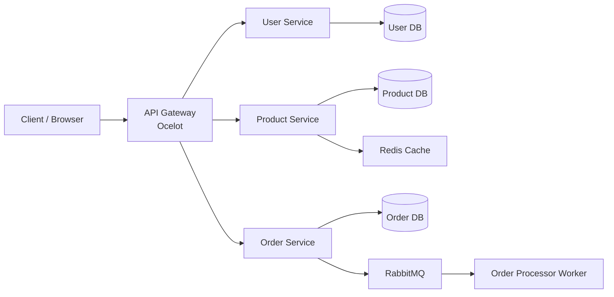

# 🚀 E-Commerce Microservices Platform

> **Production-ready E-Commerce Backend built with ASP.NET Core 8, Clean Architecture, Microservices, Docker, RabbitMQ, Redis, API Gateway (Ocelot), SQL Server, and GitHub Actions CI.**

## 📖 Project Overview

This project is a production-style **E-Commerce Backend** built using a **Microservices Architecture** with **ASP.NET Core 8**.

The solution demonstrates how modern distributed applications are designed by separating business capabilities into independent services that communicate through REST APIs and asynchronous messaging.

The platform includes dedicated services for **User Management**, **Product Management**, and **Order Management**, all exposed through an **API Gateway**. Each service follows **Clean Architecture** principles with separate Domain, Application, Infrastructure, and API layers.

The project also demonstrates enterprise-level concepts including:

* API Gateway using Ocelot
* JWT Authentication & Authorization
* RabbitMQ Event-Driven Communication
* Redis Distributed Caching
* Docker Containerization
* GitHub Actions Continuous Integration (CI)
* Repository Pattern
* Dependency Injection
* Global Exception Handling
* Request Logging
* Unit Testing using xUnit & Moq

This repository was built to simulate a real-world backend architecture and serves as a portfolio project demonstrating enterprise ASP.NET Core development practices.

## ✨ Features

### 🔐 Authentication & Authorization

* JWT Authentication
* Role-Based Authorization
* Secure Login & Registration
* Password Hashing
* Protected APIs

---

### 👥 User Service

* User Registration
* User Login
* Current User Profile
* Health Check Endpoint

---

### 📦 Product Service

* Create Product
* Update Product
* Delete Product
* Get Product by Id
* Product Pagination
* Stock Management
* Health Check Endpoint

---

### 🛒 Order Service

* Create Order
* Order History
* Order Status Updates
* Product Stock Validation
* RabbitMQ Order Events
* Health Check Endpoint

---

### 🌐 API Gateway

* Ocelot API Gateway
* Route Aggregation
* Centralized Entry Point
* Service Routing
* Swagger Support

---

### ⚡ Performance

* Redis Distributed Cache
* Asynchronous Messaging
* RabbitMQ Integration

---

### 🏗 Architecture

* Clean Architecture
* Repository Pattern
* Dependency Injection
* DTO Pattern
* Mapster Object Mapping

---

### 🐳 DevOps

* Docker Compose
* Multi-Container Environment
* GitHub Actions CI
* Service Isolation

---

### 🧪 Testing

* xUnit
* Moq
* Unit Testing
* Automated CI Test Execution

---

### 🛡 Reliability

* Global Exception Handling
* Request Logging
* Serilog Logging
* Validation

# 🏗 Architecture

This project follows a **Microservices Architecture** built with **ASP.NET Core 8** and **Clean Architecture** principles.

Each business capability is developed as an independent service with its own database, allowing services to evolve, deploy, and scale independently.

The services communicate through:

* HTTP REST APIs
* RabbitMQ (Event-Driven Messaging)
* API Gateway (Ocelot)

The solution follows the principles of:

* Clean Architecture
* SOLID Principles
* Dependency Injection
* Repository Pattern
* Domain-Driven Design (DDD) concepts
* Event-Driven Communication


## 📦 Services

### API Gateway

* Central entry point
* Request routing
* Authentication forwarding
* Swagger support

---

### User Service

Responsible for:

* User Registration
* Login
* JWT Authentication
* Authorization
* User Management

---

### Product Service

Responsible for:

* Product CRUD
* Inventory
* Product Search
* Stock Management

---

### Order Service

Responsible for:

* Order Creation
* Order Tracking
* Stock Validation
* Publishing Order Events

---

### Order Processor Worker

Responsible for:

* Consuming RabbitMQ Events
* Processing Orders
* Background Tasks

---

### Redis

Responsible for:

* Product Caching
* Faster API Responses

---

### RabbitMQ

Responsible for:

* Event-Driven Communication
* Decoupled Services
* Background Processing

## 🛠 Technology Stack

### Backend
- ASP.NET Core 8 Web API
- C#
- Clean Architecture
- REST APIs
- Entity Framework Core
- Dependency Injection
- Middleware
- Mapster

### Database
- SQL Server (Local Development)

### API Gateway
- Ocelot API Gateway
- Swagger for Ocelot

### Authentication & Security
- JWT Authentication
- Role-Based Authorization
- BCrypt Password Hashing

### Messaging
- RabbitMQ
- Background Worker Service

### Resilience
- Polly Retry Policies

### Logging
- Serilog

### Testing
- xUnit
- FluentAssertions
- Moq

### Containerization
- Docker
- Docker Compose

### CI/CD
- GitHub Actions

### Tools
- Visual Studio 2022
- Postman
- Swagger UI
- Git
- GitHub

## 📁 Project Structure

```text
ECommerce.Microservices
│
├── ApiGateway
│   ├── Middleware
│   ├── ocelot.json
│   └── Program.cs
│
├── UserService
│   ├── UserService.Api
│   ├── UserService.Application
│   ├── UserService.Domain
│   └── UserService.Infrastructure
│
├── ProductService
│   ├── ProductService.Api
│   ├── ProductService.Application
│   ├── ProductService.Domain
│   ├── ProductService.Infrastructure
│   └── ProductService.Tests
│
├── OrderService
│   ├── OrderService.Api
│   ├── OrderService.Application
│   ├── OrderService.Domain
│   ├── OrderService.Infrastructure
│   └── OrderService.Tests
│
├── OrderProcessor.Worker
│
├── Shared.Common
│
├── docker-compose.yml
│
└── ECommerce.Microservices.sln
```

### Layer Responsibilities

| Layer                     | Responsibility                                         |
| ------------------------- | ------------------------------------------------------ |
| **API**                   | Controllers, Middleware, Dependency Injection, Swagger |
| **Application**           | Business Logic, DTOs, Interfaces, Services             |
| **Domain**                | Entities, Enums, Domain Models                         |
| **Infrastructure**        | EF Core, Repositories, Database, External Services     |
| **Shared.Common**         | Shared Responses, Exceptions, Common Utilities         |
| **ApiGateway**            | Request Routing, API Gateway, Central Entry Point      |
| **OrderProcessor.Worker** | Background Processing, RabbitMQ Event Consumer         |

## 🚀 Getting Started

### Prerequisites

Before running the project, ensure the following tools are installed:

| Tool               | Version         |
| ------------------ | --------------- |
| .NET SDK           | 8.0+            |
| Visual Studio      | 2022            |
| SQL Server         | 2022 or LocalDB |
| Docker Desktop     | Latest          |
| Git                | Latest          |
| Postman (Optional) | Latest          |

---

## Clone the Repository

```bash
git clone https://github.com/rushikesh-jagdale/ecommerce-microservices-dotnet.git

cd ecommerce-microservices-dotnet
```

---

## Restore Dependencies

```bash
dotnet restore
```

---

## Build the Solution

```bash
dotnet build
```

---

## Run Unit Tests

```bash
dotnet test
```

---

## Run Using Visual Studio

1. Open **ECommerce.Microservices.sln**
2. Set multiple startup projects.
3. Start:

   * UserService.Api
   * ProductService.Api
   * OrderService.Api
   * ApiGateway
4. Run the solution (F5).

---

## Run Using Docker

Build and start all services:

```bash
docker compose up --build
```

Run in detached mode:

```bash
docker compose up -d
```

Stop all services:

```bash
docker compose down
```

---

## Verify the Services

| Service         | URL                           |
| --------------- | ----------------------------- |
| API Gateway     | http://localhost:7000/swagger |
| User Service    | http://localhost:7001/swagger |
| Product Service | http://localhost:7002/swagger |
| Order Service   | http://localhost:7003/swagger |

---

## Default Admin Account

Use the seeded administrator account to test the APIs.

| Email                                             | Password  |
| ------------------------------------------------- | --------- |
| [admin@ecommerce.com](mailto:admin@ecommerce.com) | Admin@123 |

> After logging in, copy the JWT token from the login response and use it as a **Bearer Token** in Postman or Swagger for protected endpoints.

## 📬 API Reference

The platform exposes all APIs through the **API Gateway**.

> **Gateway Base URL**
>
> ```text
> http://localhost:7000
> ```

---

# 🔐 User Service

| Method | Endpoint                 | Description                        |
| ------ | ------------------------ | ---------------------------------- |
| POST   | `/gateway/auth/register` | Register a new user                |
| POST   | `/gateway/auth/login`    | Authenticate user and generate JWT |
| GET    | `/gateway/auth/me`       | Get current authenticated user     |

---

# 📦 Product Service

| Method | Endpoint                 | Description            |
| ------ | ------------------------ | ---------------------- |
| GET    | `/gateway/products`      | Get paginated products |
| GET    | `/gateway/products/{id}` | Get product by Id      |
| POST   | `/gateway/products`      | Create a new product   |
| PUT    | `/gateway/products/{id}` | Update product         |
| DELETE | `/gateway/products/{id}` | Delete product         |

---

# 🛒 Order Service

| Method | Endpoint                      | Description         |
| ------ | ----------------------------- | ------------------- |
| POST   | `/gateway/orders`             | Create a new order  |
| GET    | `/gateway/orders`             | Get user orders     |
| GET    | `/gateway/orders/{id}`        | Get order details   |
| PUT    | `/gateway/orders/{id}/status` | Update order status |

---

## 🔑 Authentication

Protected endpoints require a JWT access token.

Example:

```text
Authorization: Bearer <your-jwt-token>
```

You can obtain a token by calling:

```text
POST /gateway/auth/login
```

---

## 📖 Swagger Documentation

| Service         | URL                           |
| --------------- | ----------------------------- |
| API Gateway     | http://localhost:7000/swagger |
| User Service    | http://localhost:7001/swagger |
| Product Service | http://localhost:7002/swagger |
| Order Service   | http://localhost:7003/swagger |

## 🔄 CI/CD Pipeline

This project uses **GitHub Actions** to automatically validate the codebase whenever changes are pushed to GitHub.

### Current CI Workflow

Every push or pull request to the **main** branch automatically performs the following steps:

```text
Developer Pushes Code
          │
          ▼
GitHub Repository
          │
          ▼
GitHub Actions
          │
          ├── Restore Dependencies
          ├── Build Solution
          ├── Run Unit Tests
          └── Report Build Status
```

### Workflow

* Restore NuGet packages
* Build the complete solution
* Execute all Unit Tests
* Fail the pipeline if any test fails
* Display the build status in GitHub Actions

### Benefits

* Prevents broken code from reaching the main branch
* Ensures every commit successfully builds
* Automatically validates unit tests
* Provides continuous feedback during development

### Future Continuous Deployment (CD)

The next phase of this project will automate deployments using GitHub Actions.

Planned deployment pipeline:

```text
Developer Push
        │
        ▼
GitHub Actions
        │
        ├── Restore
        ├── Build
        ├── Test
        ├── Build Docker Images
        ├── Push Images
        └── Deploy to Cloud
```

> **Current Status:** ✅ Continuous Integration (CI) Implemented
> **Planned:** 🚧 Continuous Deployment (CD)

## 🐳 Docker Architecture

The complete application runs inside Docker containers using **Docker Compose**.

Each microservice is isolated inside its own container and communicates through the internal Docker network.

### Container Overview

| Container              | Purpose                                     |
| ---------------------- | ------------------------------------------- |
| API Gateway            | Central entry point for all client requests |
| User Service           | Authentication & User Management            |
| Product Service        | Product Catalog & Inventory                 |
| Order Service          | Order Management                            |
| Order Processor Worker | RabbitMQ Background Consumer                |
| SQL Server             | Persistent Data Storage                     |
| RabbitMQ               | Event-Driven Messaging                      |
| Redis                  | Distributed Caching                         |

---

### Start All Services

```bash
docker compose up --build
```

---

### Stop All Services

```bash
docker compose down
```

---

### Docker Networking

All containers communicate using Docker's internal DNS.

For example:

```text
userservice:8080
productservice:8080
orderservice:8080
rabbitmq
redis
```

No service communicates using `localhost` inside Docker.

---

### API Flow

```text
Client
   │
   ▼
API Gateway
   │
   ├────────► User Service
   │
   ├────────► Product Service
   │
   └────────► Order Service
                     │
                     ▼
                RabbitMQ
                     │
                     ▼
          Order Processor Worker
```
